# Proyecto Empresa Aliada

Proyecto académico desarrollado como parte de la **Profesión Científico de Datos de EBAC**, enfocado en aplicar un proceso integral de análisis de datos sobre información comercial.

El proyecto abarca desde la preparación e integración de diferentes fuentes de datos hasta el análisis exploratorio, segmentación mediante Machine Learning y generación de pronósticos de ventas.

---

## Objetivo

Transformar información histórica de ventas en conocimiento útil para apoyar la toma de decisiones mediante:
- Limpieza e integración de datos.
- Análisis exploratorio y visualización.
- Identificación de tendencias y valores atípicos.
- Segmentación de productos con K-Means.
- Modelado de series de tiempo.
- Pronósticos de ventas.

---

## Datos utilizados

Se trabajó con cinco fuentes de datos relacionadas:

| Archivo | Contenido |
|---|---|
| `DIM_CALENDAR (2).xlsx` | Calendario y periodos de análisis |
| `DIM_CATEGORY (2).csv` | Categorías de producto |
| `DIM_PRODUCT (1).xlsx` | Información y atributos de productos |
| `DIM_SEGMENT (1).xlsx` | Segmentación y características |
| `FACT_SALES (1).csv` | Historial de ventas |

Después de validar e integrar las fuentes se obtuvo un dataset consolidado de:

- **122,002 registros**
- **20 variables**
- **350 productos únicos**

---

## Herramientas y tecnologías

- Python
- Jupyter Notebook
- Pandas
- NumPy
- Matplotlib
- Seaborn
- Scikit-learn
- Statsmodels
- SQL Server
- Power BI
- Excel / CSV

---

# Metodología

## 1. Preparación, limpieza e integración de datos

Las diferentes fuentes fueron revisadas para identificar:

- Valores nulos.
- Registros duplicados.
- Tipos de datos incorrectos.
- Inconsistencias entre llaves.
- Correspondencia entre tablas dimensionales y la tabla de ventas.

Posteriormente se estandarizaron los nombres de las variables y se realizaron uniones mediante `merge`.

El proceso conservó las **122,002 observaciones originales**, generando una base consolidada de **20 variables y sin valores nulos**.

### Resultado de la integración

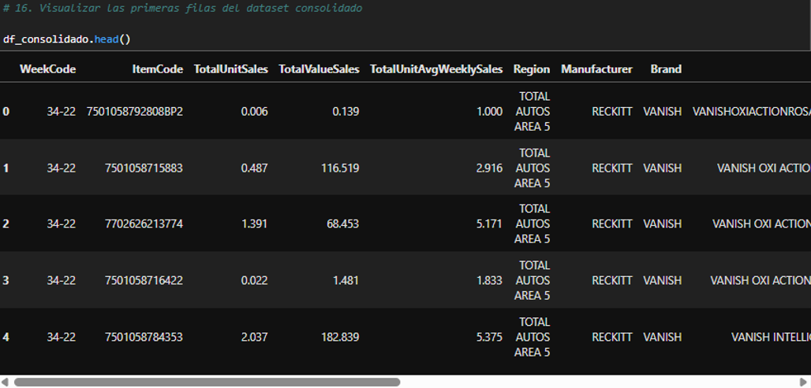

---

## 2. Análisis Exploratorio de Datos (EDA)

Se analizaron las distribuciones, relaciones y evolución temporal de las ventas utilizando Matplotlib y Seaborn.

El análisis incluyó:

- Distribución de ventas en valor y unidades.
- Comparaciones por región, marca y producto.
- Tendencias de ventas a lo largo del tiempo.
- Promedios móviles.
- Correlaciones entre variables.
- Identificación de posibles valores atípicos.

Los datos mostraron una distribución fuertemente asimétrica, con numerosas ventas de bajo valor y un número reducido de observaciones considerablemente mayores.

### Distribución de ventas

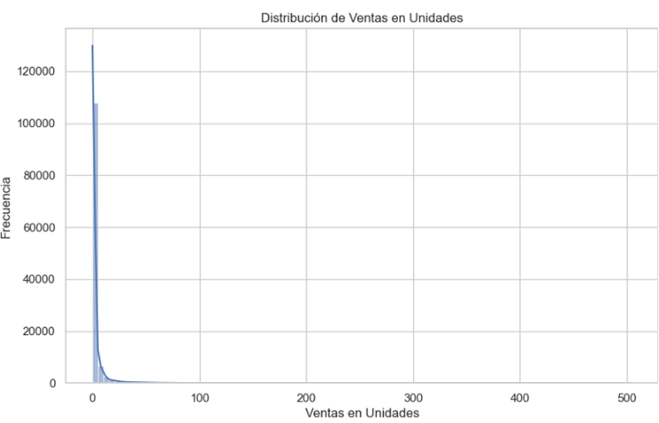

### Tendencia temporal

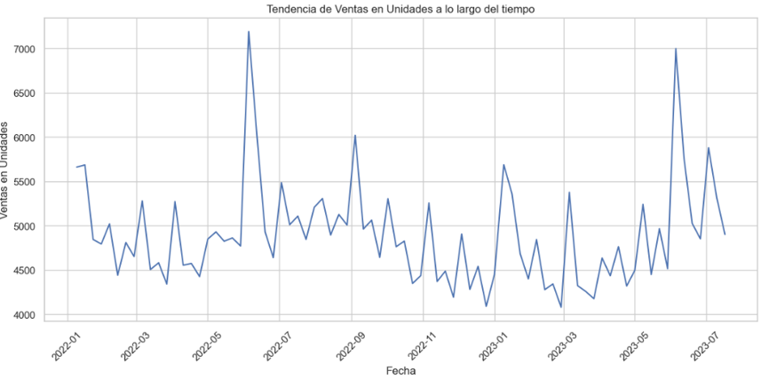

### Ventas por región

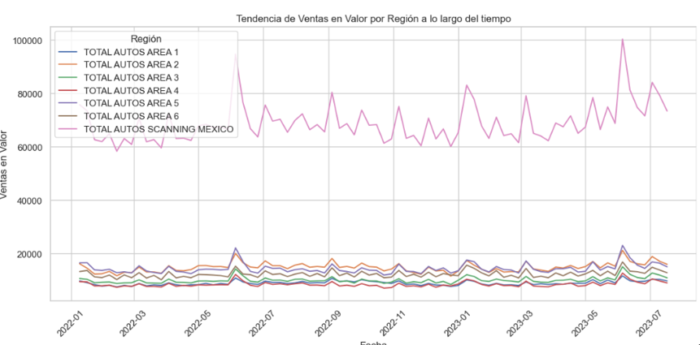

### Relación entre unidades y valor

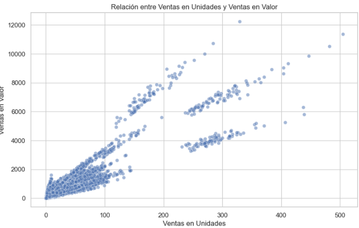

### Correlaciones

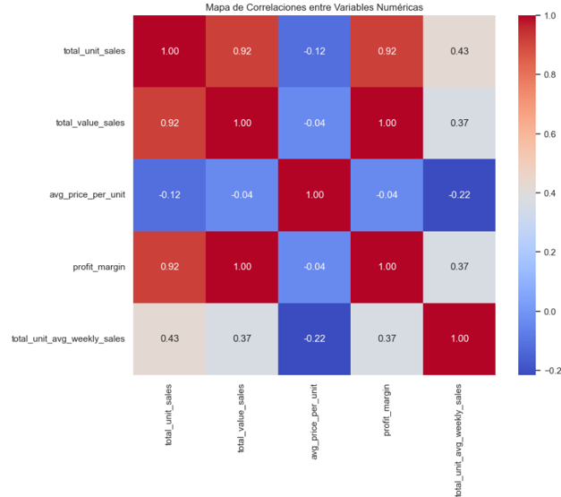

---

## 3. Segmentación de productos mediante K-Means

Para el análisis de clustering, las observaciones de ventas fueron agregadas a nivel producto:

**1 fila = 1 producto**

Se utilizaron variables relacionadas con:

- Ventas totales en unidades.
- Ventas totales en valor.
- Ventas promedio semanales.
- Categoría.
- Formato.
- Atributos del producto.
- Segmento.
- Participación regional de ventas.

Las variables numéricas fueron estandarizadas mediante `StandardScaler` y las variables categóricas mediante `OneHotEncoder`.

El dataset utilizado por K-Means quedó compuesto por:

- **350 productos**
- **32 variables**

---

## Selección del número de clusters

Se evaluaron valores de `k = 2` a `k = 10` utilizando:

- Método del Codo.
- Silhouette Score.

El método del codo mostró una reducción progresiva de la inercia, mientras que el Silhouette Score permitió identificar una separación especialmente clara con:

**k = 2**

**Silhouette Score = 0.7069**

### Método del Codo

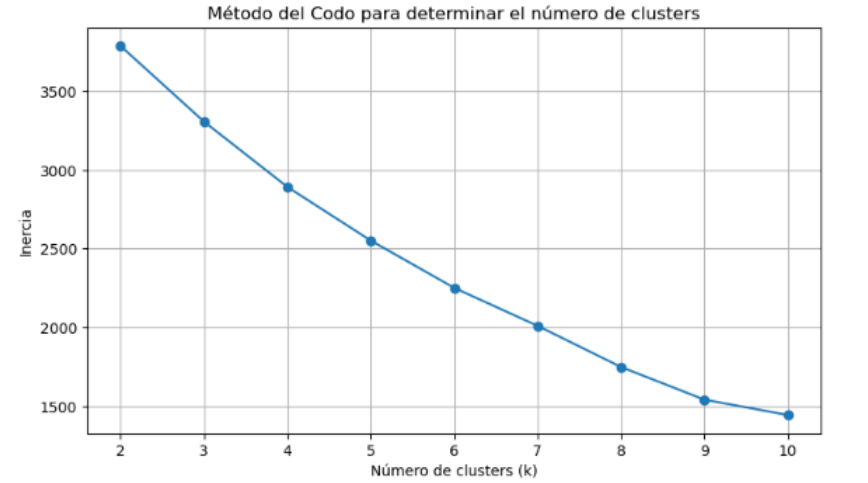

### Silhouette Score

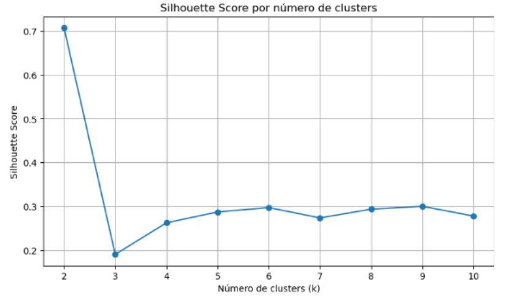

---

## Resultados del clustering

El modelo identificó dos grupos claramente diferenciados:

| Indicador | Cluster 0 | Cluster 1 |
|---|---:|---:|
| Productos | 347 | 3 |
| Participación del portafolio | 99.14% | 0.86% |
| Ventas medias en unidades | 778.83 | 41,080.47 |
| Ventas medias en valor | 23,337.73 | 981,556.00 |
| Ventas promedio semanales | 7.66 | 88.28 |

El **Cluster 1** está compuesto por únicamente tres productos CLORALEX de formato líquido y segmento BLEACH.

Aunque representan solamente **0.86% del portafolio**, concentran aproximadamente **26.67% del valor total vendido**, por lo que fueron identificados como productos de desempeño excepcional.

### Visualización mediante PCA

Para visualizar los clusters se aplicó Principal Component Analysis (PCA).

Los dos primeros componentes explicaron conjuntamente **33.42% de la variabilidad**, permitiendo observar la separación de los productos de mayor desempeño.

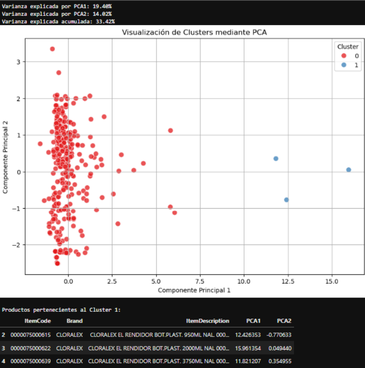

### Comparación de ventas por cluster

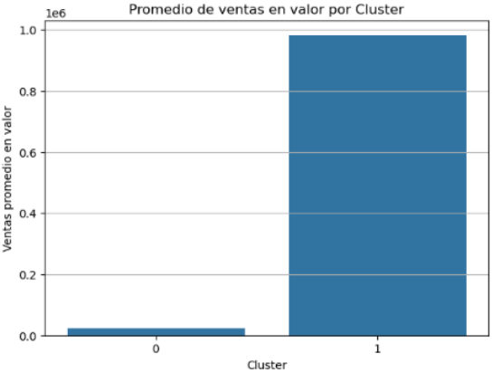

---

## 4. Análisis de Series de Tiempo

Se analizaron las ventas históricas de las marcas **Vanish y Lysol** para identificar tendencias y desarrollar modelos de pronóstico.

El proceso incluyó:

- Visualización de las series temporales.
- Promedios móviles.
- Análisis de estacionariedad.
- Diferenciación.
- Evaluación de modelos ARIMA.
- Diagnóstico de residuos.
- Comparación entre valores reales y predichos.
- Pronóstico de ventas futuras.

### Serie temporal Vanish

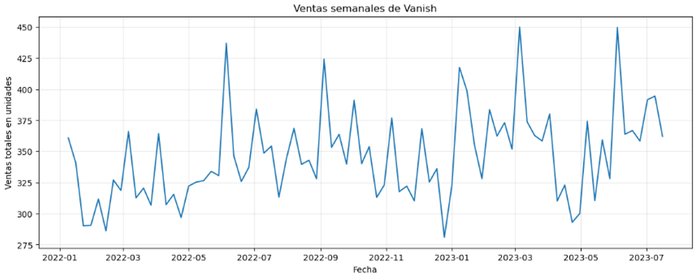

### Serie temporal Lysol

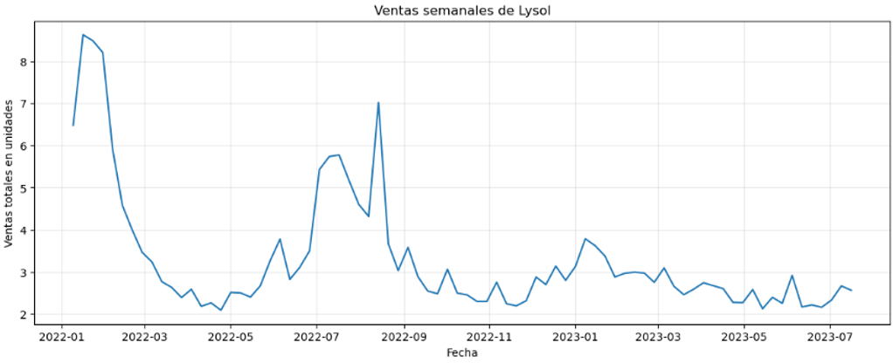

---

## Modelos predictivos

Se desarrollaron modelos ARIMA para generar pronósticos de ventas a **12 semanas**.

Los modelos obtuvieron los siguientes resultados:

| Marca | MAPE |
|---|---:|
| Vanish | **9.46%** |
| Lysol | **10.24%** |

Estos resultados permitieron generar pronósticos sobre el comportamiento esperado de ambas marcas.

### Pronóstico Vanish

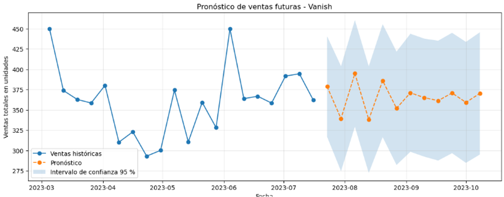

### Pronóstico Lysol

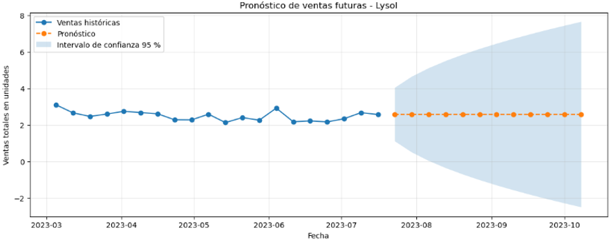

---

# Principales hallazgos

El análisis permitió identificar varios patrones relevantes:

- Se consolidaron correctamente **122,002 registros de ventas** procedentes de cinco fuentes.
- El análisis exploratorio identificó distribuciones asimétricas y numerosos valores extremos.
- **TOTAL AUTOS SCANNING MEXICO** concentra aproximadamente el **50% del valor de las ventas**.
- Se segmentaron **350 productos** mediante K-Means.
- La solución `k = 2` obtuvo un **Silhouette Score de 0.7069**.
- Sólo **3 productos** conforman el cluster de desempeño excepcional.
- Estos productos representan **0.86% del portafolio**, pero aproximadamente **26.67% del valor total vendido**.
- Se desarrollaron modelos ARIMA para Vanish y Lysol.
- Los pronósticos obtuvieron **MAPE de 9.46% y 10.24%**, respectivamente.

---

# Conclusiones

El proyecto demuestra cómo diferentes técnicas de Ciencia de Datos pueden integrarse para transformar información histórica de ventas en conocimiento útil para la toma de decisiones.

El análisis permitió avanzar desde la preparación de datos hasta la identificación de patrones comerciales, segmentación de productos y generación de pronósticos.

La combinación de análisis exploratorio, Machine Learning y Series de Tiempo permite comprender tanto el comportamiento histórico del negocio como posibles escenarios futuros.

---

# Recomendaciones

- Analizar los factores comerciales detrás de los productos identificados como de alto desempeño.
- Utilizar estrategias diferenciadas para productos de alto, medio y bajo rendimiento.
- Profundizar el análisis de las regiones con mayor concentración de ventas.
- Incorporar los pronósticos de ventas a procesos de planeación e inventario.
- Actualizar periódicamente los modelos utilizando nueva información.
- Incorporar variables adicionales como precio, promociones, inventario y disponibilidad.

---

# Archivos del repositorio

## Datos

- `DIM_CALENDAR (2).xlsx`
- `DIM_CATEGORY (2).csv`
- `DIM_PRODUCT (1).xlsx`
- `DIM_SEGMENT (1).xlsx`
- `FACT_SALES (1).csv`
- `datos_consolidados.csv`
- `productos_clusterizados.csv`

## Jupyter Notebooks

- `Proyecto Empresa Aliada Entregable 1.ipynb`
- `Proyecto Empresa Aliada Entregable 2.ipynb`
- `Proyecto Empresa Aliada Entregable 3.4.ipynb`
- `Proyecto Empresa Aliada Entregable 6.ipynb`

## SQL

- `Proyecto Entregable 4_2.sql`

## Modelos

- `modelo_kmeans.pkl`
- `preprocesador_clustering.pkl`

El repositorio también contiene la **presentación final del Proyecto Empresa Aliada**, en la que se resumen los principales análisis y resultados obtenidos.

---

# Autor

**Juan Carlos Kern**

Proyecto desarrollado como parte de la **Profesión Científico de Datos de EBAC**.

---

## Nota

Este repositorio corresponde a un proyecto académico desarrollado con fines educativos y de portafolio profesional.
